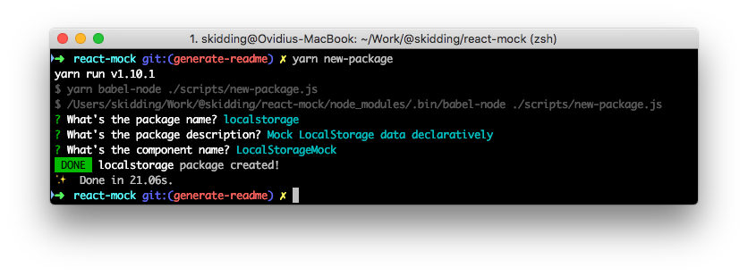

# `react-mock`

[](https://travis-ci.com/skidding/react-mock) [](https://codecov.io/gh/skidding/react-mock)

Declarative mocks for React state and global APIs.

## Jump to

- [Component state](#component-state)
- [Fetch requests](#fetch-requests)
- [LocalStorage](#localstorage)
- [XHR requests](#xhr-requests)
- **[How to contribute](#how-to-contribute)**

## Component state

Inject React component state declaratively.

```js
import { StateMock } from '@react-mock/state';

render(
  <StateMock state={{ count: 5 }}>
    <Counter />
  </StateMock>
);
```

## Fetch requests

A declarative wrapper for the wonderful [fetch-mock](http://www.wheresrhys.co.uk/fetch-mock/).

> **Note:** FetchMock mocks the global Fetch API, so only one FetchMock instance should be rendered at once.

```js
import { FetchMock } from '@react-mock/fetch';

// Passing fetch-mock options
render(
  <FetchMock options={{ matcher: '/login', response: 401, method: 'POST' }}>
    <MyComponent />
  </FetchMock>
);

// Passing fetch-mock config
render(
  <FetchMock
    matcher="/posts"
    response={200}
    config={{ fallbackToNetwork: true }}
  >
    <MyComponent />
  </FetchMock>
);
```

Check how fetch was called using fetch-mock's [inspection methods](http://www.wheresrhys.co.uk/fetch-mock/#api-inspectionfiltering).

> **Note:** Import _fetchMock_ from `@react-mock/fetch` to ensure you're inspecting on the right fetch-mock instance.

```js
import { fetchMock } from '@react-mock/fetch';

const [, { body }] = fetchMock.lastCall('/login', 'POST');
expect(JSON.parse(body)).toEqual({ user: 'harry' });
```

## LocalStorage

Mock LocalStorage data declaratively.

> **Note:** LocalStorageMock mocks the global localStorage API, so only one LocalStorageMock instance should be rendered at once.

```js
import { LocalStorageMock } from '@react-mock/localstorage';

render(
  <LocalStorageMock items={{ sessionId: 're4lt0k3n' }}>
    <MyComponent />
  </LocalStorageMock>
);
```

## XHR requests

A declarative wrapper for the great [xhr-mock](https://github.com/jameslnewell/xhr-mock).

> **Note:** XhrMock mocks the global XMLHttpRequest API, so only one XhrMock instance should be rendered at once.

```js
import { XhrMock } from '@react-mock/xhr';

// GET
render(
  <XhrMock
    url="/users"
    response={(req, res) => res.body(JSON.stringify(users))}
  >
    <MyComponent />
  </XhrMock>
);

// POST
render(
  <XhrMock url="/login" method="POST" response={(req, res) => res.status(401)}>
    <MyComponent />
  </XhrMock>
);
```

## How to contribute

_TODO_


